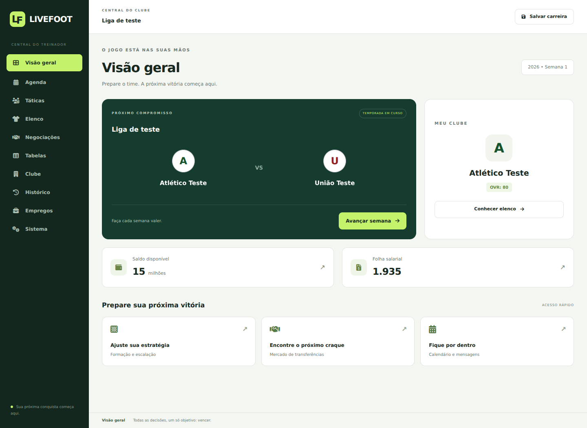

# LiveFoot

Manager de futebol inspirado pelo Brasfoot, com interface responsiva em português.

## Executar

O projeto continua estático, sem servidor de aplicação ou etapa de compilação obrigatória.

```bash
python -m http.server 8080
```

Abra `http://localhost:8080`. A base inicial está vazia: use **Importar base** para
carregar seu JSON com `countries`, `competitions` e `teams`, ou **Importar elenco**
para o formato existente com `sourceData`. Os formatos de importação e de saves
foram mantidos. Salve sua carreira pelo botão **Salvar carreira**; o progresso é
baixado como JSON.

## Interface reformulada

- Identidade LiveFoot em verde floresta, verde claro e superfícies claras.
- Seleção de clube com busca por nome ou treinador, ignorando acentos.
- Estado inicial com importação em destaque e acesso ao editor de dados.
- Menu lateral persistente, com nomes acessíveis nos botões compactos do celular.
- Painel com próximo jogo, clube, orçamento, salários e atalhos de gestão.
- Tabelas, formulários, detalhes dos jogadores e modais com estilos unificados.
- Campo tático com altura adequada e rolagem no celular.
- Correção da confirmação do treinador na primeira seleção de clube.
- Correção dos campos ausentes de pontos fortes e fracos no perfil do jogador.



Os clubes da prévia são dados temporários de teste e não foram adicionados à base.

## Estilos e ícones locais

Os estilos utilitários e os ícones estão incluídos no repositório. A interface não
precisa carregar Tailwind ou Font Awesome por CDN. Fotos e escudos definidos na
base importada ainda podem depender dos respectivos endereços externos.

- `css/redesign.css`: componentes, cores e adaptações responsivas.
- `css/style.css`: estilos de apoio às telas existentes.
- `css/utilities.css`: utilitários compilados a partir do HTML e dos scripts.
- `css/vendor/fontawesome/`: ícones, fontes e licença do Font Awesome 6.7.2.

Ao adicionar classes utilitárias ao HTML ou aos scripts, recompile:

```bash
npm ci
npm run build:css
npm run check
```

O `vercel.json` inclui os arquivos de fontes na publicação estática.

## Validação realizada

Teste em Chromium com uma base fictícia de dois clubes e uma liga: importação
JSON, busca sem acentos, seleção de clube, confirmação de nome, navegação pelas
nove áreas de gestão, abertura do perfil de jogador, mudança para 4-3-3 e abertura
do editor. Esses fluxos concluíram sem erros de JavaScript. Inspeção visual do
painel e das telas principais em desktop (1440 px) e celular (390 px), sem
transbordamento horizontal da página no painel móvel. A validação da temporada descrita abaixo usa resultados controlados.

## Divisões por país

1. Abra **Editor → Divisões** no país desejado. Adicione e nomeie as divisões;
   as setas organizam os níveis. Divisões com clubes ou competições vinculados
   precisam ser esvaziadas antes de serem excluídas.
2. Em **Clubes**, escolha a **Divisão inicial** de cada time.
3. Em **Competições e Fases**, escolha a **Divisão da competição**. A seleção
   inicial de participantes usa país e divisão, inclusive quando o clube ainda
   possui o vínculo antigo `compId` na base. Classificados de fases anteriores
   e regras explícitas de classificação continuam sendo respeitados.
4. Use **Salvar** e **Exportar** para conservar a base em um arquivo JSON.

Países guardam `divisions: [{id, name}]`; clubes guardam `countryId` e
`divisionId`; competições guardam `divisionId`. Os IDs das divisões são locais
a cada país. Bases anteriores recebem uma primeira divisão automaticamente;
competições sem divisão mantêm seus vínculos originais. Competições filhas
herdam a divisão da competição base, salvo uma seleção própria.

Estas configurações definem a divisão inicial e os participantes. Acesso,
rebaixamento e playoffs automáticos podem ser ativados na competição base. As alterações são
feitas no editor antes de iniciar a carreira; não recalculam partidas já
salvas. Ao trocar de país ou aba, os campos editados são mantidos na memória.

## Posições no campo tático

- Arraste um titular pelo campo, ou selecione-o e toque/clique na região desejada.
- Com o jogador focado, use as setas do teclado; Shift reduz o passo de movimento.
- O ataque fica no topo. A região determina GO, ZC, LE/LD, VOL, MLG, MLE/MLD,
  MAT, PTE/PTD ou CA, mostrados na etiqueta acima do jogador.
- A posição natural não é alterada. A função tática determina a penalidade de
  improvisação, o OVR mostrado e a força efetiva utilizada na simulação.
- Selecionar dois jogadores continua permitindo trocá-los. **Restaurar desenho**
  reposiciona os titulares sem mudar sua escalação; escolher outra formação
  remove o desenho personalizado. Fora da partida, refaz a escalação automática;
  durante a partida, preserva os titulares e o banco, sem substituições gratuitas.
- A posição personalizada de cada vaga fica em `gameState.myLineup.positions`
  e acompanha o JSON do jogo salvo. Saves anteriores usam o desenho padrão.
- Abrir as táticas durante uma partida pausa a simulação. Retome a partida na
  tela de transmissão após ajustar o time.

## Verificações desta atualização

`npm test` inclui testes de regressão sobre compatibilidade de bases,
filtragem por país/divisão, herança de divisão em competições filhas, funções
por região, cálculo da força e persistência das coordenadas.

Também foram verificados em Chromium: criação de divisões, seleção no editor de
clubes/competições, proteção de exclusão, geração das partidas de duas divisões,
conteúdo do JSON exportado, arraste real, teclado, restauração do desenho e
recarregamento do save, sem erros de JavaScript nesses fluxos. O painel tático
foi inspecionado em 1440 e 390 px. O teste de exportação inspeciona o JSON gerado;
não depende do gerenciador de downloads do navegador.

## Partidas, goleiros e estilos de jogo

- A antiga posição ATA é convertida para CA, inclusive na escalação automática.
- Existe uma única partida ativa. **Voltar à partida em andamento**, o avanço
  de semana e a reabertura da transmissão preservam o minuto, o placar e os
  eventos. O intervalo e os acréscimos não são confundidos com o apito final.
- Abrir as táticas pausa a partida. As substituições feitas nessa pausa contam
  para o limite de cinco e atualizam os jogadores em campo. Quem já saiu ou foi
  expulso não pode retornar. Mudanças de formação preservam os mesmos jogadores.
- Goleiros ocupam a vaga fixa no centro da área defensiva. Não podem ser
  arrastados para o ataque nem trocados por um jogador de linha. A seleção de
  autores de gols, assistências e lances ofensivos exclui os goleiros; a narração
  de defesas é específica para eles.
- **Estilo** oferece Equilibrado, Ofensivo, Defensivo, Contra-ataque e Posse de
  bola. A descrição mostra o efeito nas chances de criação e na exposição
  defensiva. Contra-ataque ganha eficiência contra o estilo Ofensivo.
- O JSON do save inclui a partida em andamento, que é restaurada pausada.

## Rebaixamento automático e playoffs

No **Editor → Competições e Fases → Acesso, rebaixamento e playoffs**, ative a regra na
liga principal da divisão superior. Selecione uma competição base da divisão
imediatamente inferior, no mesmo país e com o mesmo ano inicial. Apenas uma
competição por divisão pode definir essa movimentação.

A última divisão não exige uma divisão inferior e não tem rebaixamento.
Regras antigas de rebaixamento ativadas nela são desconsideradas. O acesso da
última divisão é definido na liga imediatamente superior; o editor informa
qual regra está vinculada.

Escolha a tabela de referência (anual agregada ou uma fase de liga), o número de
trocas diretas e o formato do playoff. Zero trocas diretas permite decidir
todas as vagas de acesso pelo playoff de promoção. As quantidades são validadas para impedir falta de participantes
ou sobreposição das zonas de acesso e rebaixamento.

| Formato | Funcionamento |
| --- | --- |
| Sem playoff | Os últimos N descem e os primeiros N da liga inferior sobem. |
| Própria divisão | Os P clubes logo acima da zona de queda direta jogam um turno único. Os últimos V caem. O número de participantes P e de vagas V é configurável. Os primeiros N + V da liga inferior sobem. |
| Pelo acesso | Os P melhores clubes da divisão inferior após os N promovidos diretamente disputam um turno único entre si. Os primeiros V do playoff sobem. Na divisão superior, os últimos N + V caem diretamente. Participantes e vagas são configuráveis. |
| Misto | Para V vagas, classificam-se V clubes de cada divisão, depois de excluir as vagas diretas. Cada confronto tem um clube de cada divisão, em jogo único na casa do clube da divisão superior. O vencedor fica na divisão superior; o perdedor, na inferior. Empate leva a pênaltis. |

No misto, o melhor classificado da divisão superior enfrenta o pior dos
classificados da inferior. Nos playoffs internos de acesso e rebaixamento, os desempates são pontos, saldo,
gols marcados e classificação original da liga.

As tabelas mostram faixas e etiquetas vermelhas para queda direta, amarelas para
playoff e verdes para acesso. A tabela de referência define a movimentação;
as demais fases não recebem uma zona fictícia. O painel também mostra os
confrontos dos playoffs, seus resultados e os pênaltis, quando houver.

Os playoffs entram na agenda e podem ser disputados na transmissão. Seus pontos
não alteram a liga regular. Todas as movimentações do país são aplicadas juntas
após as ligas e os playoffs terminarem; isso evita que um clube atravesse duas
divisões numa única temporada. A temporada seguinte espera essa resolução, mantém
os tamanhos das divisões e usa as novas inscrições dos clubes. Há um relatório na
caixa de mensagens. Configurações e progresso dos playoffs acompanham o JSON.

## Vencedores classificados ao playoff de promoção

No editor da regra, escolha o formato **Pelo acesso** e marque as origens em
**Vencedores com vaga no playoff de promoção**. É possível selecionar fases de
liga, mata-matas que terminam com um vencedor e competições cuja última fase
define um vencedor único. Cada origem reserva uma das vagas de participantes
já configuradas, sem aumentar o tamanho do playoff.

Os vencedores elegíveis têm prioridade. As vagas restantes são preenchidas pela
tabela anual utilizada para o acesso, excluindo os promovidos diretamente.
Se um vencedor já subiu diretamente, ganhou várias origens selecionadas ou não
é elegível para o acesso dessa divisão, sua vaga passa ao próximo clube elegível
da tabela. Não há participantes duplicados nem clubes da zona de rebaixamento
ocupando essas vagas.

O playoff aguarda as ligas e todas as origens selecionadas terminarem. O painel
mostra os resultados pendentes e os vencedores; a tabela destaca os classificados
por título. A apuração usa resultados da mesma temporada, inclusive títulos
resolvidos por classificação direta/WO, e é preservada ao salvar o jogo.

## Validação atual

Foram aprovados **59 testes automatizados**, incluindo continuidade da partida,
substituições pausadas, limite e bloqueio de retorno, CA/ATA, goleiro fixo, escolha
de estilo, persistência, rebaixamento direto, playoffs internos e mistos,
pênaltis, atualização da próxima temporada e movimentação conjunta de três
divisões. Incluem a última divisão com regra antiga ativada, playoff de promoção
com uma ou várias vagas, retomada do estado salvo, validações e persistência do editor.

Na versão anterior, no Chromium, foi verificado o fluxo real de edição das regras, marcações na
tabela, início da partida, entrada nas táticas, troca de formação e estilo,
substituição, retorno sem reinício, save/load e conclusão da partida. Também foi
percorrido um cenário de temporada com resultados controlados, playoff misto e
entrada na temporada seguinte, sem erros de JavaScript. A interface foi
inspecionada em desktop e em 390 px de largura.

A atualização anual dos jogadores e o retorno de empréstimos aguardam o fim dos
playoffs. O editor preserva a soma de pontos na tabela anual quando a base não
define esse campo, e valida se há fases contribuindo para a tabela de referência.

Os testes de vagas por título cobrem vencedor fora da faixa da tabela, repasse
após acesso direto, duplicidade, copa terminando depois das ligas, registro de
vencedores de liga e mata-mata, persistência e validações das origens no editor.

## Playoffs pelo título

Em **Editor → Competições e Fases → Playoff pelo título**, na competição base:

1. Ative a disputa e adicione as origens de classificação. Podem ser vencedores
   de fases de liga, mata-matas com vencedor único, competições (vencedor da
   última fase) ou tabelas anuais agregadas do mesmo país.
2. Configure **Repassar vaga duplicada** individualmente em cada origem. As
   origens são processadas na ordem cadastrada. Se o vencedor já entrou, a opção
   marcada chama o próximo clube ainda não classificado da mesma origem. Sem
   repasse, a vaga é eliminada. Se a origem não tiver outro clube, a vaga também
   fica sem uso. Um clube nunca participa duas vezes.
3. Cadastre as etapas em ordem até a final. Cada etapa tem nome próprio e formato
   independente: jogo único ou ida e volta. Por exemplo, semifinal em ida e volta
   e final em jogo único. O editor valida se há etapas suficientes para as origens.
4. Escolha se haverá **título automático quando restar um único classificado**.
   Se desativado e restar apenas um, a disputa termina sem atribuição de título.
   Se não houver classificados, não há campeão.

O playoff aguarda todas as origens e a temporada regular da competição sede.
Os participantes são ordenados pelas origens, com folgas para os primeiros quando
necessário. Reduções de participantes pulam as etapas iniciais excedentes. Jogo
único e partida de volta acontecem na casa do melhor classificado. Ida e volta
somam os gols, sem vantagem por gol fora; empate no total é decidido nos pênaltis.

Os jogos entram na agenda normal e podem ser disputados na transmissão. O painel
em **Tabelas** mostra origens, repasses, etapas, confrontos, pênaltis e campeão.
A disputa não soma pontos à tabela regular. Com o playoff ativado, ele decide o
título principal no lugar da premiação automática da tabela anual. Os títulos
específicos já configurados em fases continuam independentes.

Mudanças de divisão, atualização anual dos jogadores e início da temporada
seguinte aguardam a resolução do título. Configurações, classificados, resultados
e andamento das eliminatórias são preservados no JSON de salvamento.

Os seis novos testes cobrem espera das origens, repasse por origem, título
automático ativado/desativado, formatos independentes, folgas, pênaltis apenas
ao fim do confronto, placar agregado, salvamento, integração com rebaixamento,
premiação única e persistência/validação do editor.

## Posições e fotos genéricas

| Sigla anterior | Nova sigla |
| --- | --- |
| ATA | CA |
| ME | MLE |
| MD | MLD |
| LTD | LD |
| LTE | LE |
| GOL | GO |
| MC | MLG |
| ZAG | ZC |
| MEI | MAT |

VOL, PTE, PTD e CA permanecem. Importações e salvamentos antigos são convertidos
automaticamente, incluindo múltiplas posições, elencos e posições táticas salvas.
ATA/CA passa a ser apenas CA. Formações, regiões do campo, proficiência e geração
de jogadores usam as novas siglas.

Jogadores e técnicos sem foto utilizam uma silhueta SVG embutida no aplicativo, também no campo tático.
A imagem não depende do carregamento de um arquivo externo. Avatares antigos de iniciais
criados pelo aplicativo são convertidos. Fotos reais são preservadas; imagens
que falharem ao carregar são substituídas pela imagem genérica.

## Sistema: simulação e velocidade

Em **Sistema**, desmarque **Transmissão ao vivo** para simular suas partidas
instantaneamente ao avançar. O resultado usa força, escalação e estilo de jogo;
são registrados pontos, estatísticas e renda de mandante. Jogos de playoffs
continuam usando suas regras de classificação. A mudança de modo vale para a
próxima partida; uma transmissão já iniciada permanece disponível.

A velocidade pode ser escolhida entre **0,5×, 1×, 2×, 4× e 8×**. Ela muda o ritmo
da transmissão sem alterar os minutos simulados, chances ou resultados. As duas
preferências acompanham o JSON de salvamento.

## Carreira dos jogadores e mercado

O detalhe do jogador no Elenco mostra cada temporada e clube, com escudo, jogos,
gols, assistências, cartões e nota média. Clique no clube para ver seus totais
somando todas as passagens. Clubes sem escudo cadastrado recebem um símbolo de
clube. Passagens pelo mesmo clube na mesma temporada são somadas sem duplicidade.
O histórico inclui a temporada atual e é arquivado em transferências, devoluções
de empréstimos e mudanças de temporada. Dados anteriores já presentes no save
são preservados; passagens antigas ausentes não são inventadas.

Clubes da IA agora iniciam negociações por jogadores disponíveis em elencos com
excedentes, inclusive sem marcação manual de venda. Podem comprar e emprestar,
respeitando orçamento e tamanho do elenco. As propostas ao time humano indicam
um clube interessado real e dependem da sua aceitação. Podem surgir propostas
espontâneas; colocar o jogador à venda ou para empréstimo aumenta a frequência.

Todas as negociações usam o mesmo registro: o jogador sai do vendedor e entra no
destinatário, as taxas são debitadas e creditadas, e a passagem anterior fica no
histórico. Empréstimos mantêm o clube proprietário e retornam ao encerrar a
temporada e as disputas pendentes. Jogadores já emprestados não são revendidos
nem emprestados novamente. Propostas antigas sem clube comprador não podem ser
aceitas; novas propostas trazem essa identificação.

As partidas simuladas da IA também registram jogos, gols, assistências e notas
nos jogadores que atuaram. Esses registros alimentam o histórico de carreira.

A atualização foi verificada no Chromium: fotos genéricas no Elenco, abertura
dos totais por clube, controles reais de modo/velocidade em Sistema e partida
instantânea com resultado e estatísticas, sem erros de JavaScript. Os testes
cobrem também pagamento das transferências, propostas, devolução única dos
empréstimos, negociações automáticas e preservação do histórico entre temporadas.

## Formatos do playoff de promoção

Na regra de **Acesso, rebaixamento e playoffs**, escolha **Pelo acesso** e depois
**Formato do playoff de promoção**:

| Formato | Como decide o acesso |
| --- | --- |
| Liga | Todos se enfrentam. Os primeiros colocados ocupam as vagas. |
| Mata-mata | Confrontos eliminatórios até restar exatamente o número de vagas. Os classificados restantes sobem. |
| Grupos | Jogos apenas dentro de cada grupo. Os primeiros colocados de cada grupo sobem, dividindo igualmente as vagas. |

Escolha **Jogo único / um turno** ou **Ida e volta / dois turnos**. No mata-mata,
a ida ocorre na casa do pior classificado e a volta na do melhor; jogo único
ocorre na casa do melhor. Empate no placar agregado leva aos pênaltis, sem critério
de gol fora. Se necessário, os primeiros classificados recebem folgas. As etapas
seguintes entram automaticamente na agenda após o encerramento da anterior.

No formato de grupos, escolha o número de grupos. Participantes e vagas devem
ser divisíveis por esse número, com ao menos dois participantes e uma vaga por
grupo. Exemplo: oito participantes, dois grupos e quatro vagas classificam os
dois primeiros de cada grupo. A distribuição alterna a ordem dos classificados
para equilibrar os grupos. O painel mostra cada classificação separadamente.

Vagas por títulos e repasses continuam funcionando nos três formatos. Pontos
do playoff não alteram a classificação da temporada regular. Configurações e
andamento acompanham o save. Bases antigas sem formato definido mantêm a liga
em turno único, inclusive playoffs já iniciados.

Os novos testes cobrem formatos, grupos, folgas, várias vagas, ida e volta,
pênaltis, continuidade após salvar, manutenção do tamanho das divisões e
validação/persistência dos controles do editor.

## Fases individuais do playoff de promoção

No editor de **Acesso, rebaixamento e playoffs**, use **Adicionar fase** na seção
**Fases individuais do playoff de promoção**. Para cada fase, configure:

- Nome e ordem (botões Subir, Descer e Remover).
- Formato: liga, grupos ou mata-mata.
- Um ou dois turnos, ou jogo único/ida e volta no mata-mata.
- Quantidade de classificados para a próxima fase.
- Número de grupos, quando aplicável.

Exemplo com oito participantes e duas vagas: grupos com oito clubes, dois grupos,
um turno e quatro classificados; depois mata-mata com ida e volta e dois
classificados, que serão os promovidos. Também é possível separar semifinal e
final em fases de mata-mata com regras distintas.

Cada fase começa com pontos zerados. A próxima só inicia quando a anterior
termina, e o painel identifica as fases, tabelas e classificados. Apenas os
classificados da última fase sobem. Seu número deve coincidir exatamente com as
vagas de promoção. O editor valida a redução de participantes em cada etapa e
a distribuição das vagas por grupo.

Quando há fases individuais, elas substituem o formato geral do playoff. Sem
elas, o formato geral continua funcionando como nas versões anteriores. As
origens por título e seus repasses selecionam os participantes da primeira fase;
as fases seguintes recebem exclusivamente os classificados da fase anterior.
O salvamento mantém o histórico e o andamento de todas as fases.

Três novos testes verificam grupos seguidos de mata-mata em ida e volta, ligas
sequenciais com pontos zerados, continuidade após salvar, promoção apenas na
última fase, validação da progressão e campos individuais do editor.

## Interface e central de competições

A interface usa uma nova paleta azul e verde, controles mais espaçosos, contraste
mais claro e navegação organizada em Dia a dia, Temporada e Preferências. O editor
apresenta os dados básicos primeiro; regras de movimentação e disputa de título
ficam em seções recolhíveis. Campos e valores permanecem disponíveis ao salvar,
mesmo quando a seção está fechada.

A antiga tela **Tabelas** agora se chama **Competições**. Ela reúne:

- Filtros de país, competição e temporada, independentes do mercado.
- Classificação anual e fases regulares.
- Fases dos playoffs de promoção, rebaixamento, mistos e de título.
- Tabelas completas, grupos, jogos, placares e pênaltis.
- Etapas ainda aguardando classificados e indicação do andamento.

Os playoffs são exibidos na mesma navegação e com os mesmos componentes das fases
regulares. A promoção aparece tanto na competição superior quanto na inferior
vinculada. As fases individuais mantêm seus nomes, grupos e resultados. O seletor
de temporada permite consultar resultados anteriores preservados no save.
A exibição unificada não mistura os pontos dos playoffs com os da fase regular.

No desktop, as fases ficam na coluna lateral da competição; no celular, em um
seletor compacto. Tabelas largas têm rolagem própria, sem ampliar a página.

Validação: 53 testes aprovados. No Chromium, foram verificados grupos de promoção,
final pelo título, fases pendentes, preservação dos valores no editor recolhível,
seletores e layout em 1440 px e 390 px, sem erros de JavaScript.

## Histórico de títulos por competição

Em **Histórico**, selecione o país e uma competição com campeões registrados.
Competições sem campeões não aparecem no seletor. A classificação mostra apenas
clubes com títulos, ordenados pelo total, com escudo, quantidade cadastrada no
editor, quantidade conquistada na carreira e soma total. Os campeões por
temporada permanecem disponíveis abaixo da classificação.

Os registros de campeões por temporada não são somados novamente aos contadores
de títulos da carreira. Ao iniciar outra carreira, as conquistas da simulação
anterior são zeradas; os títulos históricos cadastrados no editor permanecem.
Três novos testes cobrem soma, ausência de duplicidade, filtro das competições,
títulos somente cadastrados e estado vazio.

## Artilheiros por competição

A aba **Artilheiros** permite escolher país, competição e temporada. Mostra
jogador, foto, clubes representados, gols, jogos e média de gols por partida.
Ordenação: mais gols, menos jogos e nome. Clubes de passagens anteriores na mesma
competição permanecem no registro após uma transferência.

As partidas ao vivo, instantâneas e simuladas da IA alimentam o ranking quando
são concluídas. Fases de competições filhas também entram no total da competição
base. Playoffs de movimentação entram nas competições vinculadas, como na tela
de fases. Disputas de pênaltis não contam como gols. O registro por partida evita
contagem duplicada e acompanha o salvamento.

Saves antigos não possuem a distribuição histórica de gols por competição e
passam a registrar esse detalhamento nas próximas partidas, sem reconstrução
artificial dos artilheiros anteriores.

## Simulação, vencedores e propostas

O cálculo de gols usa expectativa por 90 minutos, com vantagem de mando,
força relativa e estilo tático. Times equilibrados ficam próximos de 2,7 gols
somados por partida. Os modos instantâneo e ao vivo usam a mesma taxa, ajustada
aos intervalos de dois minutos da transmissão. Não há corte artificial de
placares: goleadas continuam possíveis, sem a frequência excessiva anterior.
Resultados já salvos permanecem intactos.

Após a conclusão dos playoffs, a tela de fases destaca os campeões, promovidos
e vencedores da disputa pela permanência. Competições filhas aparecem dentro
da principal, sem opção separada no seletor da aba Competições.

Negociações mostra a quantidade de propostas de compra e empréstimo pendentes,
com cartões para aceitar ou recusar. Mensagens gerais não entram no contador.

Validação: 65 testes automatizados, incluindo 20 mil simulações com semente
fixa, vencedores dos três tipos de playoff, agrupamento das competições e
contador de propostas. Verificação em navegador de fases, destaque do vencedor,
propostas e layout móvel sem transbordamento horizontal.

## Contratos, energia e desenvolvimento

- Propostas identificam Compra ou Empréstimo. Negociações lista somente
  competições base. O nome do atleta abre o mesmo perfil do Elenco, incluindo
  jogadores da CPU, histórico, contrato, energia, pontos fortes e estatísticas.
- Contratos geram avisos na Agenda aos 90 e 30 dias finais, com contador e botão
  de renovação. Renovar acrescenta um ano e aumenta o salário em 10%. O vínculo
  vencido libera o jogador, limpa sua escalação e preserva seu histórico. Atletas
  livres podem ser contratados sem taxa no mercado. A CPU renova seus vínculos.
  Salários mensais em milhares são debitados proporcionalmente a cada semana.
- Atletas de linha gastam 28,8 pontos de energia por 90 minutos; goleiros, 10,8.
  A recuperação semanal é de 20 pontos, limitada a 100. A transmissão aplica o
  gasto aos jogadores em campo; substituídos deixam de cansar. Na simulação
  instantânea, os titulares recebem o gasto integral. A energia reduz a força
  efetiva e a CPU considera esse fator para escolher os titulares.
- Treinos permitem escolher um ponto a desenvolver ou novo ponto forte. Custam
  0,5 M inicialmente, acrescendo 0,5 M por sessão daquele jogador, sem reinício
  anual. O atributo aprendido entra nos pontos fortes, sai das fraquezas e dá
  +1 OVR, até 99. Treinar consome energia; exige orçamento e vínculo próprio.
- A cada cinco avaliações, média a partir de 7,5 dá +1 OVR; abaixo de 5,8, -1.
  A evolução anual considera idade e desempenho. O rating do clube acompanha
  a média dos seus onze melhores jogadores, enquanto a força de partida também
  considera escalação, posição e energia.

Validação desta atualização: 73 testes automatizados e testes em navegador dos
perfis de compra/venda, treino, avisos contratuais e visualização móvel.

## Técnicos, mercado livre e leitura do campo

A carreira usa o nome escolhido pelo humano no clube inicial. O treinador
substituído entra no mercado de técnicos, preservando nome e foto. Técnicos da
CPU podem rescindir ou ser demitidos (com maior chance após cinco jogos ruins),
e clubes vagos contratam técnicos livres de qualquer país. A troca de clube do
humano também libera o técnico substituído e deixa o antigo cargo disponível.
As movimentações ficam em `managerHistory`, com controle por semana para evitar
processamento repetido. O treinador humano não é movimentado pela rotina da CPU.

Negociações tem a opção **Jogadores sem contrato** no seletor de clubes, com
perfil completo e contratação sem taxa. O Elenco mostra avisos junto ao nome:
prazo do contrato e quantidade/tipo de propostas, com interessados no tooltip.
Os avisos refletem os contratos e propostas atuais.

No campo, overall, energia e nome têm espaços separados, sem quebra do número
do overall. O valor exibido considera desgaste e adaptação à posição.
A influência da diferença de overall foi ampliada na fórmula comum às partidas
ao vivo e instantâneas, preservando a possibilidade de empates e surpresas.

Validação: 78 testes, incluindo técnicos livres/demissões, avisos, contratação
sem clube e 10 mil jogos entre times com 20 pontos de diferença (mando alternado;
mais de 70% de vitórias do mais forte; média inferior a 4,5 gols por jogo).
Verificação em navegador do campo desktop/móvel, avisos e mercado de livres.

## Aprendizado, táticas da CPU e histórico do mercado

Cada jogador pode aprender **duas posições adicionais** e **dois pontos fortes**,
com limites independentes e permanentes. Posições e qualidades naturais não
ocupam essas vagas. Treinos anteriores são considerados na migração dos limites,
sem remover habilidades já existentes. O custo crescente é compartilhado entre
os dois tipos de treino. Posições aprendidas recebem proficiência plena.

A CPU compara as formações disponíveis e distribui os jogadores buscando a
melhor soma de força com adaptação às posições e energia. O estilo depende da
força dos setores e dos pontos fortes disponíveis. Estilos modificam criação
e exposição defensiva na fórmula comum às partidas ao vivo e instantâneas.
A escalação pode ser consultada em Negociações e durante a transmissão, usando
os titulares registrados no início da partida.

O avanço e a retomada de partidas são bloqueados com titulares ausentes ou
repetidos. Vagas causadas por expulsões são permitidas. Clubes da CPU podem
liberar jogadores com média inferior a 6,2 no vencimento contratual, quando há
histórico de desempenho suficiente. Os avisos contratuais permanecem ao lado
do nome do atleta no Elenco.

O histórico expansível em Negociações reúne transferências registradas, incluindo
compra, empréstimo, retorno, contratação livre e fim de contrato. Movimentações
que aconteceram antes da existência do registro não são reconstruídas.

Validação: 83 testes automatizados, incluindo limites independentes, formação
compatível com elenco, escalação incompleta, estilos e vencimentos da CPU.
No navegador: treino de posição, bloqueio do avanço e consulta das escalações
no mercado e durante uma partida.

## Correção da progressão do mata-mata

As regras de entrada de clubes são aplicadas apenas ao início da fase, evitando
que eliminados retornem nas rodadas seguintes. Cada rodada possui identificação
própria. A conclusão aguarda todas as partidas, incluindo a volta, e não pode
ser processada novamente pelo mesmo estado de fase.

Confrontos usam o placar agregado. Empates registram pênaltis e o vencedor nos
jogos, em vez de selecionar um vencedor sem registrar o desempate. As folgas
respeitam a quantidade final de classificados, inclusive valores que não são
potências de dois. Fases com vários classificados não atribuem título a um deles.
Classificação automática com um único clube também registra o vencedor da fase.

Validação: 89 testes, incluindo seis regressões de mata-mata: torneio completo
com regras de entrada, ida/volta e restauração do estado, seis clubes com folgas,
meta de três classificados, participante único e passagem para a próxima fase.
A correção vale para o processamento das rodadas; não desfaz resultados já
registrados em saves anteriores.

## Troféus de fase e classificação geral do mata-mata

Fases de liga e grupos com **Dá Troféu ao Vencedor** agora registram o título
antes de seguir para a próxima fase. Em grupos, a entrega usa o primeiro da
classificação conjunta da fase (pontos, saldo e gols). No mata-mata, o troféu
continua exigindo um único vencedor. Cada título é identificado por fase e
temporada para impedir duplicação no processamento.

Os jogos mata-mata somam pontos, jogos e gols na tabela geral quando a opção
**Somar na Tabela Geral** está habilitada, incluindo times vindos de regras de
entrada. Reprocessar o mesmo resultado não soma novamente. A configuração da
fase também é respeitada quando ela já não está ativa. Pênaltis não alteram
os gols nem os pontos da tabela.

Ao concluir o mata-mata final da competição que soma na tabela geral, campeão
e vice recebem primeiro e segundo lugares, com identificação visual. As demais
posições seguem pontos, saldo e gols. Os números reais são preservados, sem
pontos artificiais para forçar a ordenação.

Validação: 93 testes automatizados, com regressões específicas de troféus,
participantes adicionados à tabela, fases excluídas e ordem dos finalistas.
As correções não recalculam conquistas ou partidas já encerradas em saves antigos.

## Técnico, folha salarial e filtros de navegação

- A consulta da escalação da CPU mostra o técnico atual do clube, inclusive
  após trocas de treinador.
- Salários são provisionados a cada semana, proporcionalmente ao salário mensal,
  e descontados do caixa somente no encerramento da temporada, após playoffs.
  Cada clube paga uma única vez por temporada, com registro persistido no save.
  O clube humano recebe o relatório do pagamento na Agenda. Em saves antigos,
  valores semanais já pagos não são cobrados de novo; o provisionamento começa
  com as próximas semanas.
- Empregos oferece seleção de país e competição base e lista os clubes daquela
  competição. Competições filhas não aparecem nesse seletor.
- Competições só disponibiliza temporadas iniciadas: tabelas futuras preparadas
  não são suficientes para expor uma temporada. Saves antigos usam jogos,
  estatísticas disputadas e histórico como evidência de início. Antes do início,
  o seletor fica desativado e não mostra dados de temporadas futuras.
- Energia: vermelho abaixo de 40%, amarelo de 40% a 69% e verde a partir de 70%.
  As cores aparecem no Elenco, no perfil e no campo tático, mantendo o número.

Validação: 98 testes automatizados, incluindo pagamento ao encerrar a temporada,
ausência de débito semanal/duplicado, temporadas futuras, cores e técnico atual.

## Importação de times pelo link do Sofascore

Na seleção de clubes, use **Importar do Sofascore**, cole o link de um time de
futebol e clique em **Buscar time**. Confira a prévia, escolha uma competição
base de destino (ou crie/use uma liga no país informado) e confirme. Exportar a
base guarda a importação. Importar novamente o mesmo ID atualiza esse cadastro,
sem duplicá-lo. Alterações da base destinam-se a uma nova carreira.

Importa nome, escudo, técnico, estádio/capacidade quando disponíveis, elenco,
nacionalidade, foto, idade e vencimento contratual quando informados. Posições
resumidas do serviço são mapeadas G→GO, D→ZC, M→MLG, F→CA. Revise funções mais
específicas no editor. Overall é escolhido na prévia; salário (20 mil/mês),
valor (1 M) e orçamento inicial (15 M) são padrões do jogo, não dados oficiais.

A consulta usa `api/sofascore.js`, incluída na configuração de funções da Vercel.
É necessário publicar o projeto completo com essa função; abrir o HTML local
ou hospedar apenas os arquivos estáticos não oferece importação por link.
A função aceita somente links HTTPS de times de futebol do domínio Sofascore,
consulta caminhos fixos, limita o tempo e não segue redirecionamentos.

O serviço pode bloquear consultas (403) ou limitar acesso (429); o jogo informa
isso sem alterar a base. A validação real neste ambiente recebeu HTTP 403.
Não há promessa de disponibilidade permanente dessa integração. Os 102 testes
passaram, incluindo links, validação, atualização sem duplicidade e respostas
do serviço simuladas; uma importação real completa não foi validada.

## Diagnóstico de “Failed to fetch”

Para executar localmente com importação por link, use Node.js 20 ou superior:

```sh
npm start
```

Abra `http://localhost:3000`. O servidor local entrega os arquivos do jogo e a
mesma função de importação usada na Vercel. Abrir `index.html` diretamente ou
usar hospedagem exclusivamente estática não executa essa função.

A interface distingue falta de conexão, função ausente, resposta inválida,
tempo excedido e bloqueio do Sofascore. A consulta do time e do elenco ocorre
em paralelo, evitando somar os tempos das duas requisições. Os limites de tempo
continuam ativos; não há tentativa de contornar bloqueios do serviço externo.

104 testes passaram, incluindo requisições reais ao servidor local para HTML,
validação da API e isolamento dos arquivos, além de falhas simuladas de rede.
A causa de uma falha específica em hospedagem externa exige verificar seu URL.
